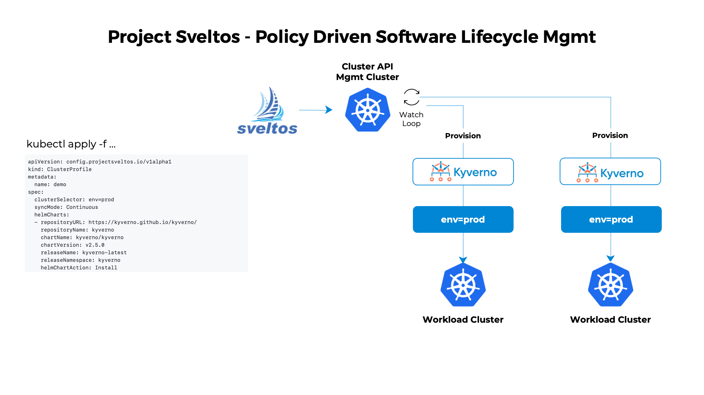

[Sveltos](https://github.com/projectsveltos) is a lightweight application designed to manage hundreds of clusters. It does so by providing declarative APIs to deploy Kubernetes add-ons across multiple clusters.

Sveltos focuses not only on the ability to scale the number of clusters it can manage, but also to give visibility to exactly which add-ons are installed on each cluster.

Sveltos comes with support to automatically discover [ClusterAPI](https://github.com/kubernetes-sigs/cluster-api) powered clusters. But it is not limited to that. Any other cluster (GKE for instance) can easily be [registered](register-cluster.md#register-cluster) with Sveltos. Then, Sveltos can manage Kubernetes add-ons on all the clusters seamless.


## How does Sveltos work?

Sveltos provides declarative APIs for provisioning Kubernetes add-ons such as Helm charts or raw Kubernetes YAML in a set of Kubernetes clusters.

Sveltos provides few custom resource definitions (CRDs) to be configured.

The idea is simple:

1. from the management cluster, selects one or more clusters with a Kubernetes [label selector](https://kubernetes.io/docs/concepts/overview/working-with-objects/labels/#label-selectors);
1. lists which Kubernetes add-ons need to be deployed on such clusters.

## Quick example

By simply creating an instance of [ClusterProfile](https://github.com/projectsveltos/sveltos-manager/blob/main/api/v1alpha1/clusterprofile_types.go), Sveltos can be instructed on what add-ons to deploy and where.

Following ClusterProfile instance is instructing Sveltos to deploy Kyverno helm chart in any cluster with label *env:prod*

```yaml
---
apiVersion: config.projectsveltos.io/v1alpha1
kind: ClusterProfile
metadata:
  name: demo
spec:
  clusterSelector: env=prod
  helmCharts:
  - repositoryURL: https://kyverno.github.io/kyverno/
    repositoryName: kyverno
    chartName: kyverno/kyverno
    chartVersion: v2.5.0
    releaseName: kyverno-latest
    releaseNamespace: kyverno
    helmChartAction: Install
```



For a quick video of Sveltos, watch the video [Sveltos introduction](https://www.youtube.com/watch?v=Ai5Mr9haWKM) on YouTube.

## More examples

1. Deploy calico in each CAPI powered cluster [clusterprofile.yaml](https://raw.githubusercontent.com/projectsveltos/sveltos-manager/main/examples/calico.yaml)
2. Deploy Kyverno in each cluster [clusterprofile.yaml](https://raw.githubusercontent.com/projectsveltos/sveltos-manager/main/examples/kyverno.yaml)
3. Deploy multiple helm charts [clusterprofile.yaml](https://raw.githubusercontent.com/projectsveltos/sveltos-manager/main/examples/multiple_helm_charts.yaml)
