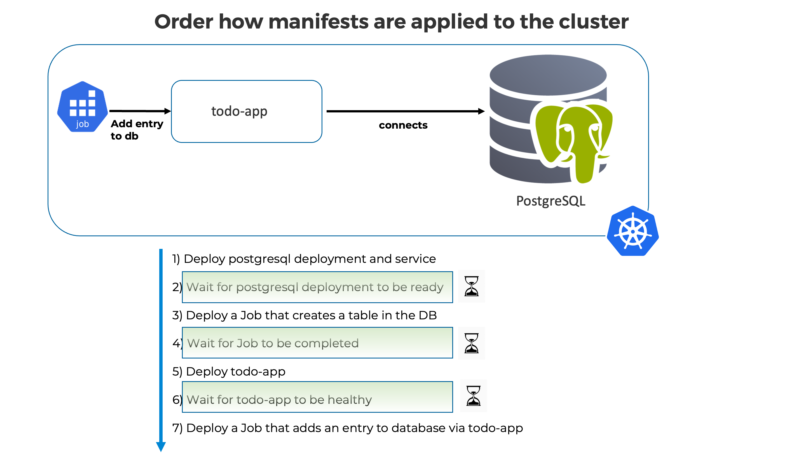

In some cases, it is necessary to deploy Kubernetes resources only after other resources are in a healthy state. For example, a Job that creates a table in a database should not be deployed until the database Deployment is healthy.

Sveltos can help you solve this problem by allowing you to use events to control the rollout of your application.

An event is a notification that is sent when a certain condition is met. For example, you could create an event that is sent when the database Deployment becomes healthy.

You can then use this event to trigger the deployment of the Job that creates the table in the database.

By using events, you can ensure that your application is rolled out in a controlled and orderly manner.




### Deploy PostgreSQL deployment and service

[^5]With ConfigMap __postgresql-deployment__ and __postgresql-service__ containing respectively PostgreSQL Deployment and Service[^1], following ClusterProfile
will instruct Sveltos to create PostgreSQL deployment and service in all managed clusters with labels __env: fv__.

```yaml
apiVersion: config.projectsveltos.io/v1alpha1
kind: ClusterProfile
metadata:
  name: postgresql
spec:
  clusterSelector: env=fv
  policyRefs:
  - name: postgresql-deployment
    namespace: default
    kind: ConfigMap
  - name: postgresql-service
    namespace: default
    kind: ConfigMap
```

```bash
./sveltosctl show addons

+-----------------------------+-----------------+-----------+------------+---------+-------------------------------+------------------+
|           CLUSTER           |  RESOURCE TYPE  | NAMESPACE |    NAME    | VERSION |             TIME              | CLUSTER PROFILES |
+-----------------------------+-----------------+-----------+------------+---------+-------------------------------+------------------+
| default/clusterapi-workload | apps:Deployment | todo      | postgresql | N/A     | 2023-08-20 08:23:11 -0700 PDT | postgresql       |
| default/clusterapi-workload | :Service        | todo      | postgresql | N/A     | 2023-08-20 08:23:11 -0700 PDT | postgresql       |
+-----------------------------+-----------------+-----------+------------+---------+-------------------------------+------------------+
```

### Create a Table in the database

With ConfigMap __postgresql-job__ containing a Job that creates table Todo in the database[^2], following will instruct Sveltos to wait for PostgreSQL Deployment to be healthy and only then deply the Job.

```yaml
apiVersion: lib.projectsveltos.io/v1alpha1
kind: EventSource
metadata:
 name: postgresql-deployment-health
spec:
 collectResources: false
 group: "apps"
 version: "v1"
 kind: "Deployment"
 namespace: todo
 script: |
  function evaluate()
    hs = {}
    hs.matching = false
    hs.message = ""
    if obj.metadata.name == "postgresql" then
      if obj.status ~= nil then
        if obj.status.availableReplicas ~= nil then
          if obj.status.availableReplicas == obj.spec.replicas then
            hs.matching = true
          end
        end
      end
    end
    return hs
  end
---
apiVersion: lib.projectsveltos.io/v1alpha1
kind: EventBasedAddOn
metadata:
 name: deploy-insert-table-job
spec:
 sourceClusterSelector: env=fv
 eventSourceName: postgresql-deployment-health
 stopMatchingBehavior: LeavePolicies
 policyRefs:
 - name: postgresql-job
   namespace: default
   kind: ConfigMap
```

As soon as PostgreSQL deployment is healthy, Sveltos will deploy the Job. The Job will then create table __Todo__.

```bash
./sveltosctl show addons                                       
+-----------------------------+-----------------+-----------+------------+---------+-------------------------------+------------------------------+
|           CLUSTER           |  RESOURCE TYPE  | NAMESPACE |    NAME    | VERSION |             TIME              |       CLUSTER PROFILES       |
+-----------------------------+-----------------+-----------+------------+---------+-------------------------------+------------------------------+
| default/clusterapi-workload | apps:Deployment | todo      | postgresql | N/A     | 2023-08-20 08:23:11 -0700 PDT | postgresql                   |
| default/clusterapi-workload | :Service        | todo      | postgresql | N/A     | 2023-08-20 08:23:11 -0700 PDT | postgresql                   |
| default/clusterapi-workload | batch:Job       | todo      | todo-table | N/A     | 2023-08-20 08:30:19 -0700 PDT | sveltos-2gv4dh8dl5fqy2z0amnx |
+-----------------------------+-----------------+-----------+------------+---------+-------------------------------+------------------------------+
```

### Deploy todo app

With ConfigMap __todo-app__ containing the todo app (ServiceAccount, Deployment, Service)[^3], following will instruct Sveltos to deploy todo app only after previous Job is done creating the table in the database.

```yaml
apiVersion: lib.projectsveltos.io/v1alpha1
kind: EventSource
metadata:
 name: postgresql-job-completed
spec:
 collectResources: false
 group: "batch"
 version: "v1"
 kind: "Job"
 namespace: todo
 script: |
  function evaluate()
    hs = {}
    hs.matching = false
    hs.message = ""
    if obj.metadata.name == "todo-table" then
      if obj.status ~= nil then
        if obj.status.succeeded == 1 then
          hs.matching = true
        end
      end
    end
    return hs
  end
---
apiVersion: lib.projectsveltos.io/v1alpha1
kind: EventBasedAddOn
metadata:
 name: deploy-todo-app
spec:
 sourceClusterSelector: env=fv
 eventSourceName: postgresql-job-completed
 stopMatchingBehavior: LeavePolicies
 policyRefs:
 - name: todo-app
   namespace: default
   kind: ConfigMap
```

```bash
./sveltosctl show addons
+-----------------------------+---------------------------+-----------+-------------+---------+-------------------------------+------------------------------+
|           CLUSTER           |       RESOURCE TYPE       | NAMESPACE |    NAME     | VERSION |             TIME              |       CLUSTER PROFILES       |
+-----------------------------+---------------------------+-----------+-------------+---------+-------------------------------+------------------------------+
| default/clusterapi-workload | apps:Deployment           | todo      | postgresql  | N/A     | 2023-08-20 08:23:11 -0700 PDT | postgresql                   |
| default/clusterapi-workload | :Service                  | todo      | postgresql  | N/A     | 2023-08-20 08:23:11 -0700 PDT | postgresql                   |
| default/clusterapi-workload | batch:Job                 | todo      | todo-table  | N/A     | 2023-08-20 08:30:19 -0700 PDT | sveltos-2gv4dh8dl5fqy2z0amnx |
| default/clusterapi-workload | :Service                  | todo      | todo-gitops | N/A     | 2023-08-20 08:36:17 -0700 PDT | sveltos-n7201iyuxbsyra94r59f |
| default/clusterapi-workload | :ServiceAccount           | todo      | todo-gitops | N/A     | 2023-08-20 08:36:17 -0700 PDT | sveltos-n7201iyuxbsyra94r59f |
| default/clusterapi-workload | apps:Deployment           | todo      | todo-gitops | N/A     | 2023-08-20 08:36:17 -0700 PDT | sveltos-n7201iyuxbsyra94r59f |
| default/clusterapi-workload | networking.k8s.io:Ingress | todo      | todo        | N/A     | 2023-08-20 08:36:17 -0700 PDT | sveltos-n7201iyuxbsyra94r59f |
+-----------------------------+---------------------------+-----------+-------------+---------+-------------------------------+------------------------------+
```

### Write entry to database

With ConfigMap __todo-insert-data__ containing a Job which will add an entry to databse[^4], following will instruct Sveltos to deploy such Job only after todo app is healthy.

```yaml
apiVersion: lib.projectsveltos.io/v1alpha1
kind: EventSource
metadata:
 name: todo-app-health
spec:
 collectResources: false
 group: "apps"
 version: "v1"
 kind: "Deployment"
 namespace: todo
 script: |
  function evaluate()
    hs = {}
    hs.matching = false
    hs.message = ""
    if obj.metadata.name == "todo-gitops" then
      if obj.status ~= nil then
        if obj.status.availableReplicas ~= nil then
          if obj.status.availableReplicas == obj.spec.replicas then
            hs.matching = true
          end
        end
      end
    end
    return hs
  end
---
apiVersion: lib.projectsveltos.io/v1alpha1
kind: EventBasedAddOn
metadata:
 name: insert-data
spec:
 sourceClusterSelector: env=fv
 eventSourceName: todo-app-health
 stopMatchingBehavior: LeavePolicies
 policyRefs:
 - name: todo-insert-data
   namespace: default
   kind: ConfigMap
```

[^1]: Get PostgreSQL YAML
```bash
wget https://raw.githubusercontent.com/projectsveltos/sveltos/main/docs/assets/postgresql_deployment.yaml
wget https://raw.githubusercontent.com/projectsveltos/sveltos/main/docs/assets/postgresql_service.yaml
kubectl create configmap postgresql-deployment --from-file postgresql_deployment.yaml 
kubectl create configmap postgresql-service --from-file postgresql_service.yaml 
```

[^2]: Get Job YAML
```bash
wget https://raw.githubusercontent.com/projectsveltos/sveltos/main/docs/assets/postgresql_job.yaml
kubectl create configmap postgresql-job --from-file postgresql_job.yaml
```

[^3]: Get todo-app YAML
```bash
wget https://raw.githubusercontent.com/projectsveltos/sveltos/main/docs/assets/todo_app.yaml
kubectl create configmap todo-app --from-file todo_app.yaml
```

[^4]: Get Job YAML
```bash
wget https://raw.githubusercontent.com/projectsveltos/sveltos/main/docs/assets/todo_insert.yaml
kubectl create configmap todo-insert-data --from-file todo_insert.yaml
```

[^5]: The example used in this document is based on and modified from [here](https://redhat-scholars.github.io/argocd-tutorial/argocd-tutorial/04-syncwaves-hooks.html).

