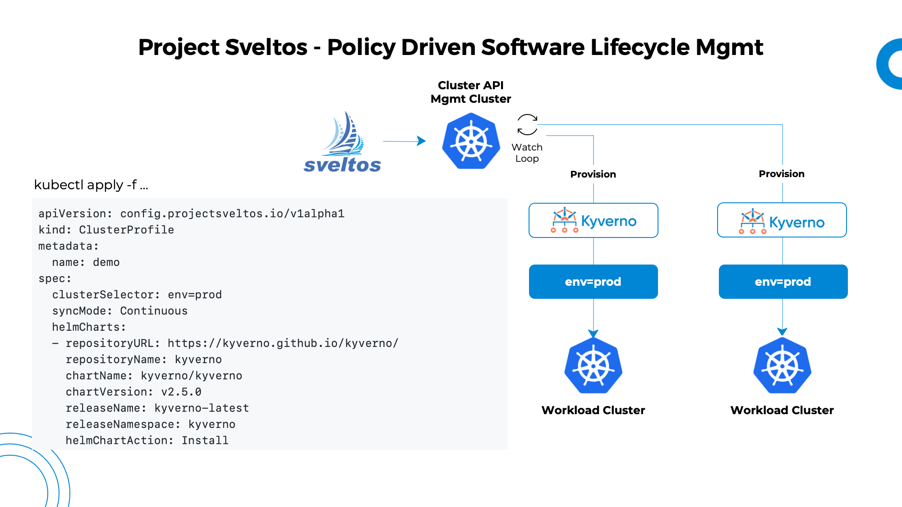

<a class="github-button" href="https://github.com/projectsveltos/sveltos-manager" data-icon="octicon-star" data-show-count="true" aria-label="Star projectsveltos/sveltos-manager on GitHub">Star</a>

Today, it's very common for organizations to run and manage multiple Kubernetes clusters across different cloud providers or infrastructures. With an increasing number of clusters, consistently managing Kubernetes add-ons is not an easy task.

[Sveltos](https://github.com/projectsveltos "Manage Kubernetes add-ons") is a lightweight application designed to manage hundreds of clusters. It does so by providing declarative cluster APIs to deploy Kubernetes add-ons across set of clusters. All while also providing platform admin with a solution for multi-tenancy.

Sveltos focuses not only on the ability to scale the number of clusters it can manage, but also to give visibility to exactly which add-ons are installed on each cluster.

## Features List
1. Kubernetes [addon distribution](addons.md) across multiple clusters;
2. [configuration drift detection](configuration_drift.md): when Sveltos detects a configuration drift, it re-syncs the cluster state back to the state described in the management cluster;
3. [Templates](template.md) instantiated reading values from management cluster;
4. [Multi-tenancy](multi-tenancy.md) allowing platform admin to easily grant permissions to tenant admins and have Sveltos enforces those;
5. [Dry run](configuration.md#dryrun-mode) to preview effect of a change; 
6. Kubernetes [cluster classification](labels_management.md) and automatic label management based on cluster runtime states;
7. [Snapshot and Rollback](snapshot.md).

## Core Concepts

Sveltos is a set of Kubernetes custom resource definitions (CRDs) and controllers to deploy kubernetes add-ons across multiple Kubernetes clusters.

1. [ClusterProfile CRD](configuration.md#deploying-add-ons) is the CRD used to instruct Sveltos on which add-ons to deploy on a set of clusters;
2. [Sveltos manager](configuration.md#sveltos-manager) is a controller running in the management cluster. It watches for *ClusterProfile* instances and *cluster* instances (both CAPI Cluster and SveltosCluster). It orchestrates Kubernetes addon deployments: when a cluster is a match for a ClusterProfile instance, all add-ons listed in the ClusterProfile instance are deployed in the cluster.
3. [Classifier CRD](configuration.md#managing-labels) is the CRD used to instructs Sveltos on how to classify a cluster;
4. [Classifier](configuration.md#classifier) is a controller running in the management cluster. Its counterpart, *Classifier Agent* is a controller running in each managed cluster. Classifier distributes Classifier CRD instances to any managed cluster. Classifier Agent watches for cluster runtime state (kubernetes version and/or resources deployed) and Classifier CRD instances. It reports back to management cluster whether a managed cluster is a match or not for each Classifier instance;
5. [RoleRequest CRD](multi-tenancy.md#rolerequest-crd) is the CRD used to allow platform admin to grant permissions to tenant admins;
6. [Sveltosctl](https://github.com/projectsveltos/sveltosctl "Sveltos CLI") is the Sveltos CLI; 
7. [Snapshot CRD](configuration.md#snapshot) is the CRD used to instruct Sveltos on collecting configuration snapshots;
8. [SveltosCluster](register-cluster.md#register-cluster) is the CRD used to register a cluster with Sveltos (only non CAPI powered cluster needs to be manually registered with Sveltos);
9.  [Drift detection manager](configuration.md#configuration-drift) is a controller running in each managed cluster. It watches for Kubernetes resources deployed by ClusterProfiles set in SyncModeContinuousWithDriftDetection mode. Anytime it detects a possible configuration drift, it informs management cluster so that a re-sync happens and the cluster state is brought back to the desidered state expressed in the management cluster.

## ✨ Configuration and examples

To know more about configuration or find some examples, please read this [section](configuration.md).

## 😻 Contributing to projectsveltos
❤️ Your contributions are always welcome! If you want to contribute, have questions, noticed any bug or want to get the latest project news, you can connect with us in the following ways:

1. Open a bug/feature enhancement on github 
2. Chat with us on the Slack in the #projectsveltos channel 
3. [Contact Us](mailto:support@projectsveltos.io)

## Support us

{==

If you like the project, please [give us a](https://github.com/projectsveltos/sveltos-manager "Manage Kubernetes add-ons")  [:octicons-star-fill-24:{ .heart }](https://github.com/projectsveltos/sveltos-manager "Manage Kubernetes add-ons") if you haven't done so yet. Your support means a lot to us. **Thank you :pray:.**

==}

[:star: projectsveltos](https://github.com/projectsveltos/sveltos-manager "Manage Kubernetes add-ons"){ .md-button .md-button--primary }

