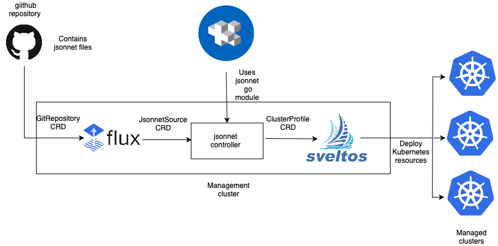

`jsonnet` is a data templating language and configuration file format designed to simplify the creation and management of complex JSON or YAML data structures. It provides a concise and flexible syntax for generating JSON-like data by defining reusable templates, composing objects and arrays, and applying transformations. If you want to use jsonnet in conjunction with Sveltos, you can install the [jsonnet controller](https://github.com/gianlucam76/jsonnet-controller) by following these steps:

```bash
kubectl apply -f https://raw.githubusercontent.com/gianlucam76/jsonnet-controller/main/manifest/manifest.yaml
```

This will install the necessary components for `jsonnet controller`.

The `jsonnet controller` offers the capability to process jsonnet files using different sources, such as Flux Sources (GitRepository/OCIRepository/Bucket), ConfigMap, or Secret. It then programmatically invokes jsonnet go module and stores the output in its Status section making it available for Sveltos.

## Using GitRepository



We can leverage GitRepository as a source for jsonnet controller[^1]. For example, in the provided GitHub repository [jsonnet-examples](https://github.com/gianlucam76/jsonnet-examples), we can find the jsonnet files that Flux will sync. To instruct the jsonnet controller to fetch files from this repository, create a JsonnetSource CRD instance with the following configuration:

```yaml
apiVersion: extension.projectsveltos.io/v1alpha1
kind: JsonnetSource
metadata:
  name: jsonnetsource-flux
spec:
  namespace: flux-system
  name: flux-system
  kind: GitRepository
  path: ./variables/deployment.jsonnet
  variables:
    deploymentName: eng
    namespace: staging
    replicas: "3"
```

The `path` field specifies the location within the Git repository where the jsonnet file is stored. Once Flux detects changes in the repository and syncs it, the jsonnet-controller will automatically invoke the jsonnet module and store the output in the Status section of the JsonnetSource instance.

At this point, you can use Sveltos' [template](template.md) feature to deploy the output of jsonnet (Kubernetes resources) to a managed cluster. The Kubernetes add-on controller will take care of deploying it. Here's an example configuration using a ClusterProfile[^2]:

```yaml
apiVersion: config.projectsveltos.io/v1alpha1
kind: ClusterProfile
metadata:
  name: deploy-resources
spec:
  clusterSelector: env=fv
  templateResourceRefs:
  - resource:
      apiVersion: extension.projectsveltos.io/v1alpha1
      kind: JsonnetSource
      name: jsonnetsource-flux
      namespace: default
    identifier: JsonnetSource
  policyRefs:
  - kind: ConfigMap
    name: jsonnet-resources
    namespace: default
---
apiVersion: v1
kind: ConfigMap
metadata:
  name: jsonnet-resources
  namespace: default
  annotations:
    projectsveltos.io/template: "true"  # add annotation to indicate Sveltos content is a template
data:
  resource.yaml: |
    {{ (index .MgtmResources "JsonnetSource").status.resources }}
```

The above configuration instructs Sveltos to deploy the resources generated by jsonnet to the selected managed clusters.

```bash
kubectl exec -it -n projectsveltos  sveltosctl-0   -- ./sveltosctl show addons 
+-------------------------------------+-----------------+-----------+------+---------+-------------------------------+------------------+
|               CLUSTER               |  RESOURCE TYPE  | NAMESPACE | NAME | VERSION |             TIME              | CLUSTER PROFILES |
+-------------------------------------+-----------------+-----------+------+---------+-------------------------------+------------------+
| default/sveltos-management-workload | apps:Deployment | staging   | eng  | N/A     | 2023-05-26 00:24:57 -0700 PDT | deploy-resources |
+-------------------------------------+-----------------+-----------+------+---------+-------------------------------+------------------+
```

## Using ConfigMap/Secret

Alternatively, you can use ConfigMap/Secret as a source for `jsonnet controller`. First, create a tarball containing the jsonnet files:

```bash
tar -czf jsonnet.tar.gz -C ~mgianluc/go/src/github.com/gianlucam76/jsonnet-examples/multiple-files .
```

Then, create a ConfigMap with the tarball:

```bash
kubectl create configmap jsonnet --from-file=jsonnet.tar.gz=jsonnet.tar.gz
```

Next, create a `JsonnetSource` instance that references this ConfigMap:

```bash
apiVersion: extension.projectsveltos.io/v1alpha1
kind: JsonnetSource
metadata:
  name: jsonnetsource-configmap
spec:
  namespace: default
  name: jsonnet
  kind: ConfigMap
  path: ./main.jsonnet
  variables:
    namespace: production
```

Outcome will be same as seen above with Flux GitRepository:

```yaml
apiVersion: extension.projectsveltos.io/v1alpha1
kind: JsonnetSource
metadata:
  annotations:
    kubectl.kubernetes.io/last-applied-configuration: |
      {"apiVersion":"extension.projectsveltos.io/v1alpha1","kind":"JsonnetSource","metadata":{"annotations":{},"name":"jsonnetsource-configmap","namespace":"default"},"spec":{"kind":"ConfigMap","name":"jsonnet","namespace":"default","path":"./main.jsonnet","variables":{"namespace":"production"}}}
  creationTimestamp: "2023-05-26T08:28:48Z"
  generation: 1
  name: jsonnetsource-configmap
  namespace: default
  resourceVersion: "121599"
  uid: eea93390-771d-4176-92fe-2b761b803764
spec:
  kind: ConfigMap
  name: jsonnet
  namespace: default
  path: ./main.jsonnet
  variables:
    namespace: production
status:
  resources: |
    ---
    {"apiVersion":"apps/v1","kind":"Deployment","metadata":{"name":"my-deployment","namespace":"production"},"spec":{"replicas":3,"selector":{"matchLabels":{"app":"my-app"}},"template":{"metadata":{"labels":{"app":"my-app"}},"spec":{"containers":[{"image":"my-image:latest","name":"my-container","ports":[{"containerPort":8080}]}]}}}}
    ---
    {"apiVersion":"v1","kind":"Service","metadata":{"name":"my-service","namespace":"production"},"spec":{"ports":[{"port":80,"protocol":"TCP","targetPort":8080}],"selector":{"app":"my-app"},"type":"LoadBalancer"}}
```

[^2]: Instructing Sveltos involves the initial step of retrieving a resource from the management cluster, which is the JsonnetSource instance named `jsonnetsource-flux` in the `default` namespace. Sveltos is then responsible for deploying the resources found within the `jsonnet-resources` ConfigMap. However, this ConfigMap acts as a template, requiring instantiation before deployment. Within the Data section of the ConfigMap, there is a single entry called `resource.yaml`. After instantiation, this entry will contain the content that the jsonnet controller has stored in the JsonnetSource instance.
[^1]: Flux is present in the management cluster and it is used to sync from GitHub repository. The GitRepository instance is following
```yaml  
  apiVersion: source.toolkit.fluxcd.io/v1
  kind: GitRepository
  metadata:
    finalizers:
    - finalizers.fluxcd.io
    name: flux-system
    namespace: flux-system
  spec:
    interval: 1m0s
    ref:
      branch: main
    secretRef:
      name: flux-system
    timeout: 60s
    url: ssh://git@github.com/gianlucam76/jsonnet-examples
```