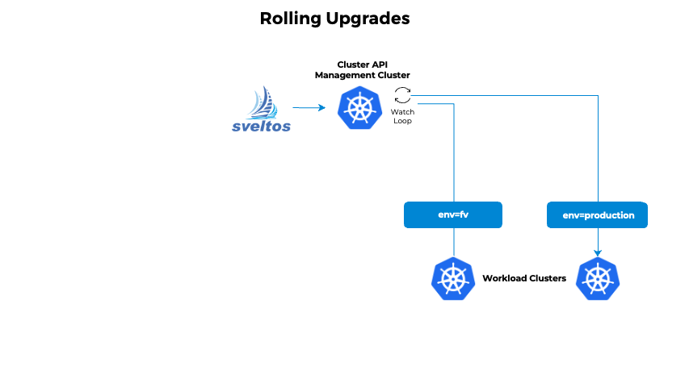

Sveltos has the capability to monitor changes within ConfigMap and Secret resources and facilitate rolling upgrades for Deployments, StatefulSets, and DaemonSets. To enable this functionality, you can activate the reloader feature by setting the __reloader__ field to true in the ClusterProfile, as demonstrated in the following example YAML configuration:

```yaml
apiVersion: config.projectsveltos.io/v1alpha1
kind: ClusterProfile
metadata:
  name: nginx
spec:
  clusterSelector: env=fv
  reloader: true
  policyRefs:
  - name: nginx-data
    namespace: default
    kind: ConfigMap
  - name: nginx
    namespace: default
    kind: ConfigMap
```

where __nginx__ ConfigMap contains a Deployment mounting a ConfigMap[^1].

The above ClusterProfile is responsible for deploying both a ConfigMap instance and a Deployment instance, with the latter mounting a ConfigMap.

```bash
sveltosctl show addons          
+-----------------------------+---------------------------------+-----------+---------------------+---------+-------------------------------+------------------------------+
|           CLUSTER           |          RESOURCE TYPE          | NAMESPACE |        NAME         | VERSION |             TIME              |       CLUSTER PROFILES       |
+-----------------------------+---------------------------------+-----------+---------------------+---------+-------------------------------+------------------------------+
| default/clusterapi-workload | :ConfigMap                      | nginx     | nginx-config        | N/A     | 2023-08-09 05:00:45 -0700 PDT | nginx                        |
| default/clusterapi-workload | apps:Deployment                 | nginx     | nginx-deployment    | N/A     | 2023-08-09 05:00:45 -0700 PDT | nginx                        |
+-----------------------------+---------------------------------+-----------+---------------------+---------+-------------------------------+------------------------------+
```

Whenever the ConfigMap that is mounted by a Deployment undergoes modifications, Sveltos will automatically initiate a rolling upgrade process for the Deployment.



By setting the __reloader__ field to true in the ClusterProfile, you enable automated rolling upgrades that ensure the latest configurations are consistently applied to your applications. This significantly simplifies the maintenance and enhancement of your Kubernetes cluster, promoting stability and efficient resource utilization.

1. Deployments: When a ConfigMap or Secret mounted by a Deployment is modified, Sveltos promptly detects the change and initiates a rolling upgrade for that Deployment. This ensures that any changes in configuration or secrets are promptly and securely propagated to the running instances of the application.
2. StatefulSets: Similar to Deployments, StatefulSets can take advantage of Sveltos' monitoring capabilities. Modifications to the ConfigMap or Secret mounted by a StatefulSet will trigger rolling updates for the StatefulSet instances. This allows for controlled and consistent updates to stateful applications while maintaining data integrity.
3. DaemonSets: Sveltos extends its monitoring to DaemonSets as well. If a ConfigMap or Secret used by a DaemonSet is modified, Sveltos takes the initiative to perform a rolling upgrade across all the nodes where the DaemonSet is deployed. This way, any changes made to the resources are efficiently propagated throughout the cluster.

[^1]:__nginx-data__ ConfigMap
```yaml
apiVersion: v1
data:
  configmap.yaml: "# nginx-config.yaml\napiVersion: v1\nkind: ConfigMap\nmetadata:\n
    \ name: nginx-config\n  namespace: nginx\ndata:\n  nginx.conf: |\n    server {\n
    \     listen 80;\n      server_name example.com;\n      \n      location / {\n
    \       root /usr/share/nginx/html;\n        index index.html;\n      }\n    }\n"
kind: ConfigMap
metadata:
  name: nginx-data
  namespace: default
```
and the __nginx__ ConfigMap
```yaml
apiVersion: v1
data:
  deployment.yaml: |
    # nginx-deployment.yaml
    apiVersion: apps/v1
    kind: Deployment
    metadata:
      name: nginx-deployment
      namespace: nginx
    spec:
      replicas: 1
      selector:
        matchLabels:
          app: nginx
      template:
        metadata:
          labels:
            app: nginx
        spec:
          containers:
            - name: nginx
              image: nginx:latest
              ports:
                - containerPort: 80
              volumeMounts:
                - name: nginx-config-volume
                  mountPath: /etc/nginx/conf.d/default.conf
                  subPath: nginx.conf
          volumes:
            - name: nginx-config-volume
              configMap:
                name: nginx-config
kind: ConfigMap
metadata:
  name: nginx
  namespace: default
```