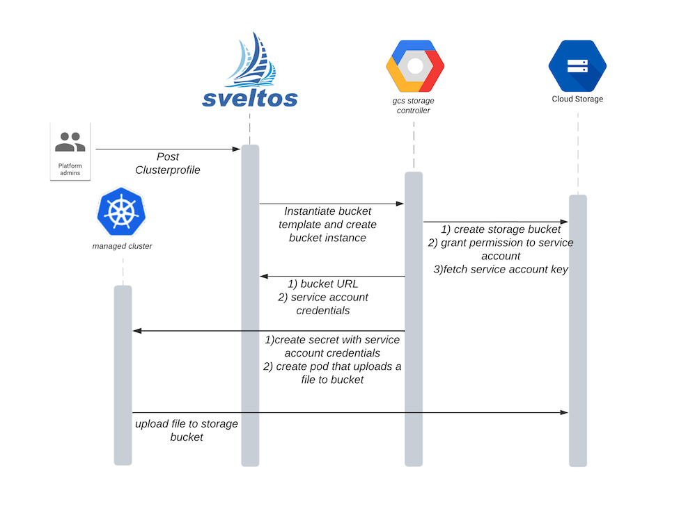

This tutorial will guide you through the process of extending Sveltos with your own controller. The tutorial focuses on extending Sveltos by using a new controller that can allocate a storage bucket from Google Cloud, followed by Sveltos deploying a pod in the managed cluster to upload a file to that bucket, all using a single YAML configuration.

If you are new to Sveltos, we recommend reading the [deploy Kubernetes add-ons](../addons/addons.md) and the [Sveltos events](../events/addon_event_deployment.md) sections before proceeding.

## Deploy Sveltos in the management cluster

Our management cluster is a Kind cluster that is running on a laptop. To deploy Sveltos on this management cluster, we followed the [instructions](../install/install.md).

```bash
kubectl get pods -n projectsveltos
NAME                                  READY   STATUS    RESTARTS   AGE
access-manager-69d7fd69fc-7mm2p       2/2     Running   0          3m58s
addon-controller-6ccff8d976-99sdb     2/2     Running   0          3m58s
classifier-manager-6489f67447-q5gs2   2/2     Running   0          3m54s
event-manager-56ffd458f7-fchkv        2/2     Running   0          3m55s
hc-manager-7b6d7c4968-52wj2           2/2     Running   0          3m55s
sc-manager-cb6786669-ncdzg            2/2     Running   0          3m57s
sveltosctl-0                          1/1     Running   0          3m41s
```

## Google Cloud Storage Buckets

When a new production cluster is created, we want to dynamically create a Google Bucket for it and grant a service account permissions to upload files to it. To automate this process, and demo Sveltos extensions, we developed a controller that can create and delete Google Storage Buckets as instructed. You can find this controller on [Github](https://github.com/gianlucam76/gcs-storage-operator).

The controller is responsible for managing instances of CRD `bucket.v1alpha1.demo.projectsveltos.io`, creating a Bucket on Google Cloud Storage, and granting service accounts the `objectCreator` permission on it.

To deploy the controller in the management cluster, please refer to the instructions in the [README](https://github.com/gianlucam76/gcs-storage-operator/blob/main/README.md) as you need to fetch some information from Google Cloud in order to give the controller permission to create buckets on Google Cloud Storage.

## Instruct Sveltos

Before posting the necessary Sveltos ClusterProfile, we need to grant Sveltos permission to create bucket instance in the management clusters.

```bash
kubectl edit clusterrole addon-controller-role-extra
```

and edit rules by adding

```yaml
rules:
- apiGroups:
  - storage.gcp.upbound.io
  resources:
  - buckets
  verbs:
  - "*"
```



The following YAML instructions are used to deploy add-ons using Sveltos:

1. The content of the ConfigMap `bucket` in the `default` namespace is deployed by Sveltos on the management cluster (`deploymentType: Local`). The contents of this ConfigMap is an instance of the `Bucket` CRD, which is expressed as a template. Before deploying it to the management cluster, Sveltos instantiates the template by setting the namespace to be the same as the namespace of the managed cluster where Sveltos deploys add-ons defined in this ClusterProfile.
2. The content of the ConfigMap `uploader` in the `default` namespace is deployed by Sveltos on the managed cluster (`deploymentType: Remote`). The contents of this ConfigMap is a Pod instance expressed as a template. Sveltos instantiates the template using information from the bucket instance created in the previous step. This Pod then uploads a file to the newly created bucket on Google Cloud Storage.

## 
```yaml
apiVersion: config.projectsveltos.io/v1alpha1
kind: ClusterProfile
metadata:
  name: deploy-resources
spec:
  clusterSelector: env=production
  templateResourceRefs:
  - resource:
      apiVersion: demo.projectsveltos.io/v1alpha1
      kind: Bucket
      name: sveltos-demo-bucket
    identifier: Bucket
  policyRefs:
  - deploymentType: Local
    kind: ConfigMap
    name: bucket
    namespace: default
  - deploymentType: Remote
    kind: ConfigMap
    name: uploader
    namespace: default
---
apiVersion: v1
kind: ConfigMap
metadata:
  name: bucket
  namespace: default
  annotations:
    projectsveltos.io/template: "true"
data:
  bucket.yaml: |
    apiVersion: demo.projectsveltos.io/v1alpha1
    kind: Bucket
    metadata:
      name: sveltos-demo-bucket
      namespace: {{ .Cluster.metadata.namespace }}
    spec:
      bucketName: "sveltos-demo-{{ .Cluster.metadata.name }}"
      location: us-central1
      serviceAccount: serviceAccount:uploader@sveltos.iam.gserviceaccount.com
---
apiVersion: v1
kind: ConfigMap
metadata:
  name: uploader
  namespace: default
  annotations:
    projectsveltos.io/template: "true"
data:
  secret.yaml: |
    apiVersion: v1
    kind: Secret
    metadata:
      name: gcs-credentials
      namespace: default
      annotations:
        bucket: {{ (index .MgtmResources "Bucket").status.bucketURL }}
    type: Opaque
    data:
      service-account.json: {{ (index .MgtmResources "Bucket").status.serviceAccountCredentials }}
  pod.yaml: |
    apiVersion: v1
    kind: Pod
    metadata:
      name: create-and-upload-to-gcs
      namespace: default
      annotations:
        bucket: {{ (index .MgtmResources "Bucket").status.bucketURL }}
    spec:
      containers:
      - name: uploader
        image: google/cloud-sdk:slim
        command: ["bash"]
        args:
          - "-c"
          - |
            echo "Hello world" > /tmp/hello.txt
            gcloud auth activate-service-account --key-file=/var/run/secrets/cloud.google.com/service-account.json
            gsutil cp /tmp/hello.txt gs://{{ (index .MgtmResources "Bucket").spec.bucketName }}
        volumeMounts:
          - name: gcp-sa
            mountPath: /var/run/secrets/cloud.google.com/
            readOnly: true
      volumes:
        - name: gcp-sa
          secret:
            secretName: gcs-credentials
```

After posting it a Bucket instance is created in the management cluster by Sveltos. 

```bash
kubectl get bucket -A
NAMESPACE   NAME                  BUCKET NAME                                BUCKET URL
default     sveltos-demo-bucket   sveltos-demo-sveltos-management-workload   https://storage.googleapis.com/sveltos-demo-sveltos-management-workload
```

The gcs-storage-controller processes this instance and creates a bucket on Google Cloud Storage.


To verify the bucket has been created on Google Cloud Storage 

```
gsutil iam get gs://<BUCKET NAME>
```

Sveltos has also deployed a Pod in the managed cluster and has passed this Pod with a secret containing the credentials to access the bucket (this information was provided to Sveltos by the gcs controller we developed). This pod has then uploaded a file to the Google Storage Bucket just created.


## Summary:

This post is a tutorial on extending Sveltos, focusing on using a new controller that can allocate a storage bucket from Google Cloud and deploy a pod in the managed cluster to upload a file to that bucket, all using a single YAML configuration.

Whenever you need to generate extra information and pass it along to managed cluster, using this scheme you can extend Sveltos by simply writing your own controller. 
