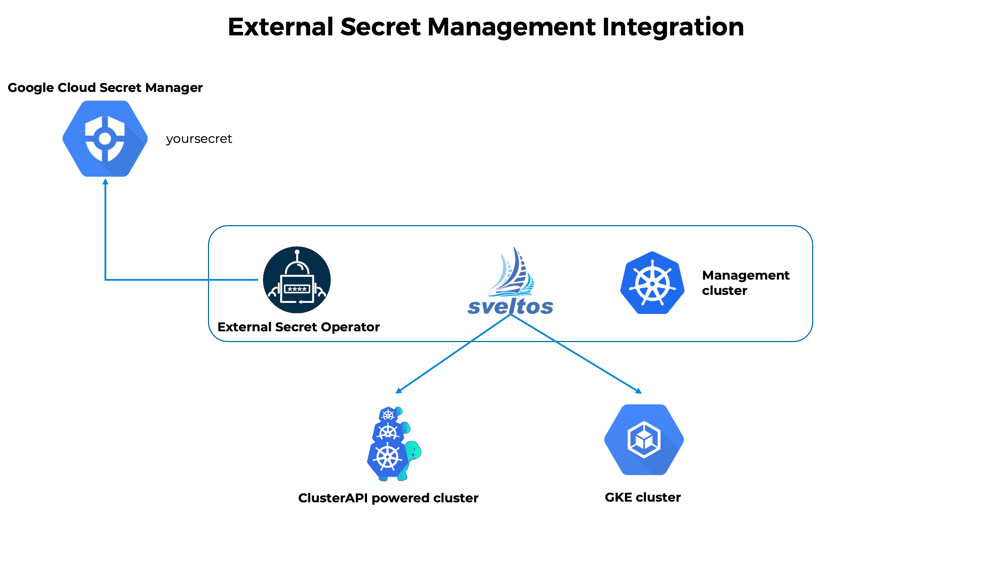

## What is a Kubernetes Secret

A secret is any piece of information that you want to keep confidential, such as API keys, passwords, certificates, and SSH keys. Secret Manager systems store your secrets in a secure, encrypted format, and provides you with a simple, secure way to access them.

Benefits of using a Secret Manager:

1. **Security:** The Secret Manager uses strong encryption to protect your secrets. Your secrets are never stored in plaintext, and they are only accessible to authorized users only.
2. **Convenience:** The Secret Manager makes it easy to manage the secrets. You can store, access, and rotate your secrets from anywhere.
3. **Auditability:** The Secret Manager provides detailed audit logs that track who accessed your secrets and when. This helps you to track down security incidents and to comply with security regulations.

## External Secret Operator

[External Secrets Operator](https://external-secrets.io) is an open source Kubernetes operator that integrates external secret management systems like AWS Secrets Manager, HashiCorp Vault, Google Secrets Manager, Azure Key Vault, IBM Cloud Secrets Manager, and many more. The goal of External Secrets Operator is to synchronize secrets from external APIs into Kubernetes.  The operator reads information from external APIs and automatically injects the values into a Kubernetes Secret. If the secret from the external API changes, the controller will reconcile the state in the cluster and update the secrets accordingly.


## Distribute Secret to managed clusters

When managing a multitude of Kubernetes clusters, External Secrets Operator can be deployed in the management cluster. Sveltos can be used to distribute the secrets to the managed clusters.


- The External Secret Operator fetches secrets from an external API and creates Kubernetes secrets;
- Sveltos distributes fetched secrets to the managed clusters;
- If the secret from the external API changes, the External Secret Operator will reconcile the state in the management cluster and update the secrets accordingly;
- Sveltos will reconcile the state in each managed cluster where secret was distributed.

## Example using Google Cloud Secret Manager

To properly follow the example, please ensure you have installed the below tools:

- Sveltos management cluster
- [external-secrets](https://external-secrets.io/v0.8.5/introduction/getting-started/#installing-with-helm) deployed in the management cluster
- gcloud cli installed



```
$ yourproject=<your-google-cloud-project-name-here>

$ gcloud config set project $yourproject

$ gcloud services enable secretmanager.googleapis.com
```

Create a secret inside Google Cloud Secret Manager

```
$ echo -ne '{"password":"yoursecret"}' | gcloud secrets create yoursecret --data-file=-

$ gcloud iam service-accounts create external-secrets

$ gcloud secrets add-iam-policy-binding yoursecret --member "serviceAccount:external-secrets@$yourproject.iam.gserviceaccount.com" --role "roles/secretmanager.secretAccessor"
```

Create a key for the service account.

```
$ gcloud iam service-accounts keys create key.json --iam-account=external-secrets@$yourproject.iam.gserviceaccount.com

$ kubectl create secret generic gcpsm-secret --from-file=secret-access-credentials=key.json
```

Now configure External Secret Operator to fetch secrets from Google Cloud Secret Manager and creates a secret in the Kubernetes management cluster.

```yaml
>cat <<EOF | kubectl apply -f -
apiVersion: external-secrets.io/v1beta1
kind: SecretStore
metadata:
  name: gcp-backend
spec:
  provider:
      gcpsm:
        auth:
          secretRef:
            secretAccessKeySecretRef:
              name: gcpsm-secret
              key: secret-access-credentials
        projectID: $yourproject
---
apiVersion: external-secrets.io/v1beta1
kind: ExternalSecret
metadata:
  name: gcp-external-secret
spec:
  secretStoreRef:
    kind: SecretStore
    name: gcp-backend
  target:
    name: imported-secret
  data:
  - secretKey: content
    remoteRef:
      key: yoursecret
EOF
```

The secret __default/imported-secret__ has been created by External Secret Operator in the management cluster.

Now we can configure Sveltos to distribute such content to all managed clusters matching Kubernetes label selector __env=fv__

```yaml
>cat <<EOF | kubectl apply -f -
apiVersion: config.projectsveltos.io/v1alpha1
kind: ClusterProfile
metadata:
  name: deploy-resources
spec:
  clusterSelector: env=fv
  templateResourceRefs:
  - resource:
      kind: Secret
      name: imported-secret
      namespace: default
    identifier: ExternalSecret
  policyRefs:
  - kind: ConfigMap
    name: info
    namespace: default
---
apiVersion: v1
kind: ConfigMap
metadata:
  name: info
  namespace: default
  annotations:
    projectsveltos.io/template: "true"  # add annotation to indicate Sveltos content is a template
data:
  secret.yaml: |
    # ExternalSecret now references the Secret created by External Secret Operator
    apiVersion: v1
    kind: Secret
    metadata:
      name: eso
      namespace: {{ (index .MgmtResources "ExternalSecret").metadata.namespace }}
    data:
      content: {{ (index .MgmtResources "ExternalSecret").data.content }}
EOF
```

Using sveltos CLI, it is possible to verify Sveltos has propagated the information to all managed clusters.

```
$ sveltosctl show addons
+-----------------------------+---------------+-----------+------+---------+-------------------------------+------------------+
|           CLUSTER           | RESOURCE TYPE | NAMESPACE | NAME | VERSION |             TIME              | CLUSTER PROFILES |
+-----------------------------+---------------+-----------+------+---------+-------------------------------+------------------+
| default/clusterapi-workload | :Secret       | default   | eso  | N/A     | 2023-07-24 05:18:19 -0700 PDT | deploy-resources |
| gke/production              | :Secret       | default   | eso  | N/A     | 2023-07-24 05:18:29 -0700 PDT | deploy-resources |
+-----------------------------+---------------+-----------+------+---------+-------------------------------+------------------+
```